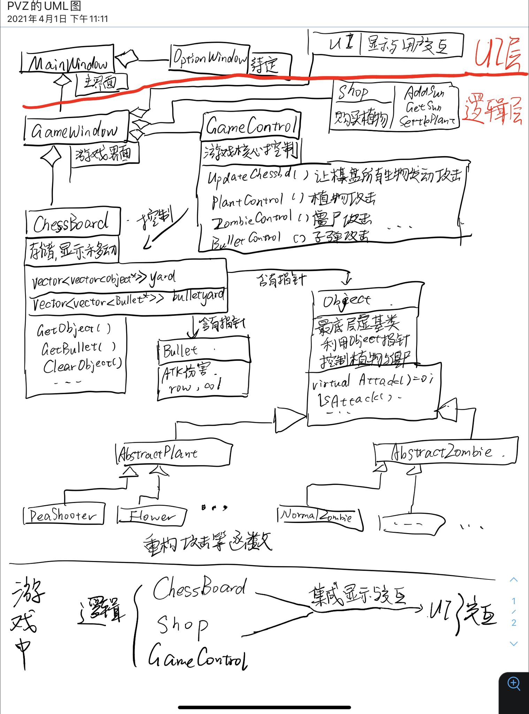
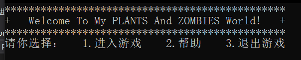
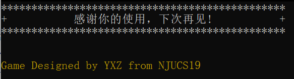
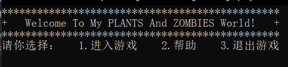
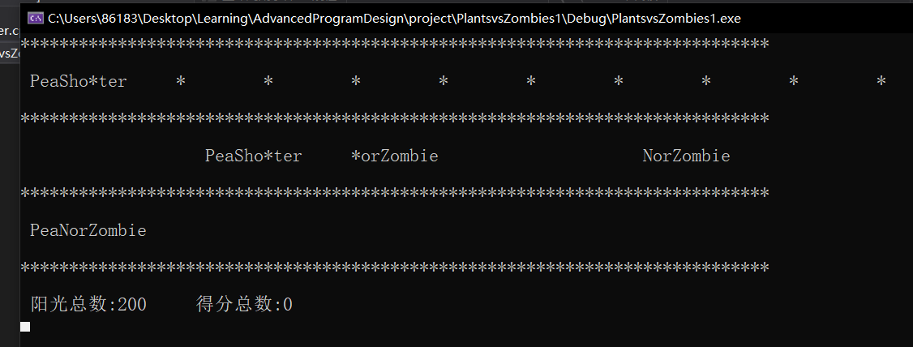
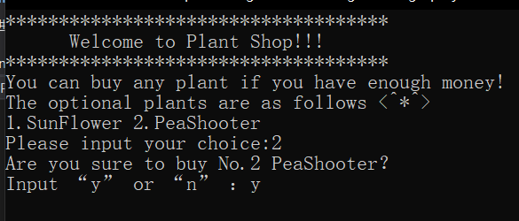
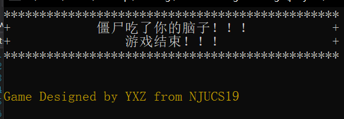
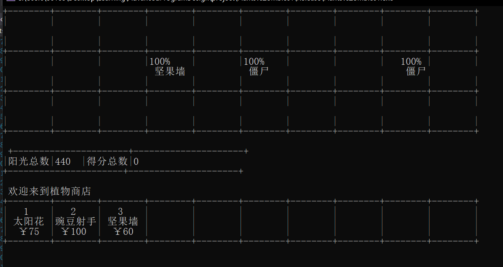
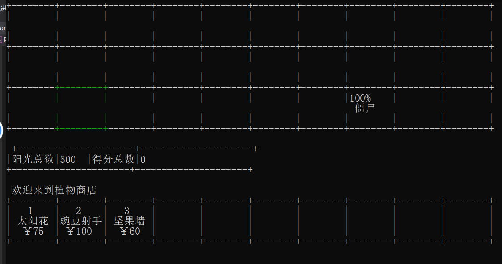

# 植物大战僵尸设计报告

**作者：尹熙喆**    **邮箱：191220146@smail.nju.edu.cn**

[TOC]

# 一.实验设计

我将这个实验的模块划分为**两大部分**：**UI层**和**逻辑层**

`UI`层用来进行界面的显示和人机交互，设计的初衷是为了将来和Qt能够更好的衔接（我刚开始的设计是每个模块都有自己的UI，这样UI的分配过于分散）

逻辑层用来控制各种游戏逻辑，其实`GameWindow`既可以算UI层也可以算逻辑层，它其实是关于逻辑和UI的桥梁，但是我更愿意把它当做逻辑层，因为毕竟是控制逻辑的模块嘛。具体的关系在下面的UML图中给出。

# 二.类模块设计

## UML图

首先我画了一张UML图，方便下面的模块理解




## 窗口UI

### 1.MainWindow

#### 数据成员

为了减小编译依赖性和精简类的尺寸，我使用了**委托**的关系。在`MainWindow`里面设置了两个子窗口类的指针，在初始化的时候`new`一下，析构的时候`delete`，合理地进行**内存管理**！

```c++
//game窗口指针，减小依赖性
GameWindow* gamewindow;
//option窗口指针
OptionWindow* optionwindow;
```

#### 成员函数

下面是一些成员函数，`ShowWindowHead` 是用来打印主窗口头部信息（比如欢迎信息！），更加用户友好。`exitMainWindow`是按键3的退出窗口界面函数，打印一些感谢信息，而退出窗口调用`PlayMusic`来进行音乐的播放（植物大战僵尸原版声音哦，算是一个**彩蛋**！！！）

```c++
void PlayMusic();
//把窗口主体展示
void ShowWindowHead();
//选3，退出窗口
void exitMainWindow();
//输错了数字
void WrongInput();
```

#### 功能



#### 

用户打开游戏时候的主界面，欢迎界面，里面有一些选择项目，目前我设计了3个选项：

1. 第一个是进入游戏，进入后就是游戏界面跳转到`GameWindow`模块
2. 这个是`OptionWindow`模块
3. 退出游戏模块，退出游戏后会显示感谢信息并且播放声音！




### 2.GameWindow

这个窗口是主游戏界面！

#### 数据成员

里面有比较关键的四个数据成员（四个关键控制类的指针），仍然采用了**委托**的关系

```c++
private:
	GameControl* gamectrl;
	ChessBoard* chessbd;
	PlantShop* pshop;
	UI* ui;
```

`GameControl`类主要用来控制棋盘上僵尸，植物，弹珠的**攻击逻辑**。

`ChessBoard`类主要用来**存储棋盘上植物僵尸和弹珠**，并且**控制他们的移动**。

`PlantShop`类是商店，通过这个来进行植物的**交易逻辑**

`UI`是进行**游戏界面显示和人机交互**的类

#### 成员函数

下面是一些主要的成员函数

```c++
//游戏函数，通过一个循环，每次更新棋盘和刷新屏幕
void Play();
//更新函数，利用gamectrl来控制chessbd
void Update();
//刷新屏幕
void Show();
```

`Play`函数是核心控制函数，其中一个`while`循环来对游戏进行不断刷新！每次刷新调用了`Update`函数和`Show`函数来分别对**逻辑**和**显示**进行刷新！其中每一次`while`循环都监控键盘时间，一旦我输入了`'b'`字符，那么我就会进入`UI`的购买界面，进行植物的购买和安置

```c++
void GameWindow::Play() {
	while (1) {
		if (_kbhit()) {//监控键盘事件
			if (_getch() == 'b') {
				ui->BuyPlant(chessbd, pshop);
			}
		}
		this->Update();
		this->Show();
		Sleep(500);//每隔0.5秒刷新一次
	}
}
```

`Update`函数是一个**逻辑更新函数**，分别调用`gamectrl`的更新函数和`chessbd`的更新函数。

```
	gamectrl->UpdateChessbd(chessbd,pshop);//对植物等Object状态进行更新
	bool flag = chessbd->Update();//棋盘的内容进行更新
	if (!flag)GameOver();
```

`gamectrl->UpdateChessbd`**控制棋盘上所有的物体进行攻击，更新所有生物的状态**

`chessbd->Update`在对于攻击之后改变了状态的物体进行一系列处理，从棋盘上**添加或者删除**等（比如植物死了），并且处理一些关于弹珠僵尸等的**移动**。值得注意的是`chessbd->Update()`会检查僵尸的状态，如果僵尸到达了边界，就会返回false，然后调用`GameOver`函数结束游戏。这里在结束游戏的时候有一个**小彩蛋**，就是会播放音乐。

`Show`函数调用`UI`的显示函数，显示游戏的具体情况

```c++
//刷新屏幕
void GameWindow::Show() {
	system("cls");
	ui->ShowChessboard(chessbd);
	ui->ShowInfo(chessbd, pshop);
}
```

`Info`里面包括一些得分信息，阳光信息等！

#### 功能

具体的功能就是显示游戏的界面，并且**控制逻辑模块存储模块和显示模块的运转**，通过一个`while`循环让程序`run`起来！

从上面的说明来看，可以看出这个模块对于游戏的控制有了一个**很好的封装**，从而**让逻辑和显示分离**，并且**让攻击和移动分离**，！这样可以更进一步地进行设计，增强逻辑性！


### 3.OptionWindow

这个模块是主窗口下辖的一个窗口，目前还没有想好里面要放什么东西。


### 4.UI

这个模块是我在写完第一阶段之后经过一段时间思考后想出来的，因为我在之前虽然实现了一些模块的分离，但是我发现，不管是哪个类，基本都有Show函数，还有一些输入输出函数，这样导致了**逻辑控制和用户界面没有分离！！！**其中一个很大的弊端就是将来在设计图形界面的时候，需要对很多类进行重构，这样的话就会导致很多奇怪的问题，所以我决定对`UI`部分进行重构！

#### 成员函数

这里面的成员函数种类非常丰富，主要分为两大类，**棋盘或者一些信息的打印**和**用户交互**

其中`BuyPlant`函数处理购买植物的过程，进行用户的交互！

```c++
	//**************************普通显示UI
	//展示棋盘
	void ShowChessboard(ChessBoard* chessbd);
	//在下面显示一些信息
	void ShowInfo(ChessBoard* chessbd, PlantShop* pshop);


	//**********************shop的UI
	//购买植物的UI
	void BuyPlant(ChessBoard* chessbd, PlantShop* pshop);
	void WrongInput();
	bool Confirm(int n);
	const RCPair SelectArea(ChessBoard* chessbd);
	void PrintSelectBox(int r, int c);
	void ShowShop();
```


## 游戏控制板块

### 5.ChessBoard

这个模块是一个非常重要的**存储+显示模块**

#### 数据成员

下面的两个关键数据成员是两个二维向量，相当于植物大战僵尸的一个个地块。第一个`yard`存储的是`Object`类的指针，实际上是**利用多态**，`Object`类的指针可以处理任何植物和僵尸，这样**有利于统一管理**。

除了下面两个`vector`，还有一些关于配置的数据成员，这里不一一列出。值得注意的是，我通过把这些地块大小和地块的数目还有每个地块之间的距离之类的变量都设置为配置变量，他们最原始的值都放在`Config.h`中，`ChessBoard`初始化的时候通过构造函数进行初始化，这样既**方便修改棋盘的大小尺寸**，还**有利于封装**，不需要类成员函数调用全局变量而导致封装性遭到破坏。

```c++
private:
	//存储行列上的植物和僵尸
	vector<vector<Object*>> yard;
	//单独用一个弹珠yard存储弹珠
	vector<vector<Bullet*>> bulletyard;
```

#### 成员函数

下面几个成员函数用来添加和删除植物僵尸和弹珠，是对外的接口，方便`GameControl`模块对它进行控制

```c++
	Object* GetObject(int r, int c) { return yard[r][c]; }
	//得到当前行列的弹珠指针
	Bullet* GetBullet(int r, int c) { return bulletyard[r][c]; }
	//清除行列的弹珠
	void ClearBullet(int r, int c);
	//清除当前行列的Obj
	void ClearObj(int i, int j);
```

我在内部设置了一个计时器`unsigned int timecounter;`，通过下面的函数对其进行操作。计时器的作用是控制僵尸或植物移动和攻击的频度，我在`Config.h`里面设置了各种常量用来表示一些时间间隔，如下面所示。

```
//僵尸产生的时间gap
const int TIME_GAP_CREATE_ZOMBIE = 10;
//植物攻击gap
const int TIME_GAP_PEASHOOTER_ATTACK = 3;
//产生阳光gap
const int TIME_GAP_CREATESUN = 4;
```

处理计时器的函数，利用取模来判断是否到达了`gap`

```c++
	//获得时间
	unsigned int GetTime()const { return timecounter; }
	//让时间增加
	void TimeUp();
```

我还设置了几个函数用来控制僵尸和弹珠的移动，对于没有死的僵尸，`GameControl`控制的是植物攻击和死亡的逻辑，而`Chessboard`则要控制没有死去的僵尸和弹珠移动，并且死亡的僵尸或者越界的弹珠进行清除（Delete）

```c++
	//查看僵尸是否适合前移
	bool CheckPos(int r,int c);
	//僵尸进行移动
	void ZombieMove(int i, int j);
	//弹珠进行移动
	void BulletMove(int i, int j);
```

下面最关键的函数就是`Update`函数，它是棋盘状态变更的**关键函数**，基本逻辑就是遍历`Object`棋盘找到死亡的僵尸，然后清除他们，如果没死的话就让他们移动；再次遍历`Bullet`棋盘，找到越界弹珠清除他们，没越界的弹珠就进行移动

```c++
bool Update();
```


#### 功能

从上面我们可以看出，`ChessBoard`的关键功能是**对植物，僵尸还有弹珠进行存储和逻辑移动**（其实移动也是存储的一部分），真正的攻击逻辑在`GameControl`（下面的那个模块），他们之间**很关键的交互是通过植物的状态**来进行！`GameControl`控制植物攻击之后，死亡的植物和僵尸将会变成`Dead`状态，然后`chessboard`进行`Update`的时候，通过检查每一个元素的状态来**清除或者移动**`Object`！通过这样一种方式，实现了**攻击和移动的分离**，也实现了**存储和控制的分离**，让模块划分更加清晰，方便拓展和更新！


### 6.GameControl

这个类主要是进行**攻击逻辑的控制**

#### 成员函数

最关键的一个函数就是下面的函数，遍历棋盘上的所有僵尸，植物，弹珠，并且调用他们的攻击函数`Attack AttackEnemy(int time)`这个函数返回一个`Attack`类的对象！（Attack类后面会讲到，里面包含了一些关于攻击的信息）

```c++
	void UpdateChessbd(ChessBoard* chessbd,PlantShop* pshop);
```

我对上述函数进行了进一步的封装，分别写了下面三个子函数，他们分别对植物，僵尸和弹珠进行控制

```c++
void PlantControl(Object* obj, ChessBoard* chessbd,PlantShop* pshop);
void ZombieControl(Object* obj, ChessBoard* chessbd);
void BulletControl(Bullet* blt, ChessBoard* chessbd);
```
他们具体的运行原理就是先**调用相应对象的攻击函数**，再**检查这个攻击对象是不是类型为None**，如果是就不攻击，否则利用`switch case`进行相应的植物攻击处理......

具体的处理原理是根据不同植物来定的，比如

对豌豆射手攻击的处理就是添加一颗弹珠，对于向日葵的处理就是在shop里面增加阳光，对于僵尸的处理就是让它攻击前面的植物，对于弹珠的处理是让它攻击自己碰到的僵尸，并且清除自己！


### 7.PlantShop

这个是交易逻辑模块，里面有一些函数，都是面向UI的接口，UI进行用户交互后，利用shop来进行逻辑控制

```c++
	//添加阳光
	void AddSun(int x) { sun += x; }
	//获取阳光
	int GetSun()const { return sun; }
	//根据类型让阳光减少
	void SubSun(Type type);
	//检查阳光是不是足够，根据植物类型判断需要的cost
	bool CheckEnough(Type type);
	//在棋盘的r，c部分安放一个植物
	bool SettlePlant(Object* obj, ChessBoard* chessbd, int r, int c);
```


## 物体板块（植物僵尸弹珠等）

### 8.Object

这个类是一个**最底层的虚基类**

这个类是**设置了一些植物和僵尸共有的特性**，包括生命值，种类，状态，行，列。

```c++
	//我的生命值
	int myhp;
	//我的种类，上面定义了枚举类型
	Type mytype;
	//我的状态，健康or死亡，最后根据这个进行清除植物和僵尸
	Status mystatus;
	//行，列
	int row, col;
```

种类和状态是我定义的枚举结构，这个是最基本的分类，其中`Status`是棋盘判断植物是否存活的参考，而Type是攻击控制模块跳转具体的Control函数的依据！

```c++
	//状态，健康和死亡，每次更新时候棋盘会检查状态，如果死亡就移除掉它
	enum Status { Healthy, Dead };
	//Object的种类，包括植物和僵尸
	enum Type { Plant_t, Zombie_t,Bullet_t };
```

我也定义了一些设置和获取基本状态的函数，这里不一一描述

```c++
	//获得type
	int GetType()const { return mytype; }
	......
	void SetRow(int r) { row = r; }
	......
```

除了一些基本量的处理，我设置了攻击函数和被攻击函数

攻击函数我设置成了纯虚函数，因为不同的植物和僵尸的攻击方式都是不同的，所以每次定义一个植物或者僵尸类，必须重新写这个函数

```c++
virtual Attack AttackEnemy(int time) = 0;
```

被攻击函数则比较简单，收到多少伤害就从`Hp`中减去就好了，如果`Hp`小于等于0就调用`Die`函数“死掉”，这里死亡函数是把状态设置为`Dead`，解释了前面的内容

```c++
//受到攻击
void Object::Isattacked(int hurt) {
	myhp -= hurt;
	if (myhp <= 0)die();
}
//设置死亡状态
void Object::die() {
	mystatus = Dead;
}
```


### 9.AbstractPlant

这个是植物的基类，它继承了`Object`类，跟`Object`不同的是，它会在构造函数里自动设置自己的类型为植物！


### 10.AbstractZombie

这个是僵尸的基类，它继承了`Object`类，里面的内容不多，但是定义了两个关于速度的函数，毕竟僵尸是可以走路的嘛

```c++
    //设置速度值
    void SetSpeed(int sp) { speed = sp; }
    //获取速度值
    int GetSpeed()const { return speed; }
```

还有一个是在构造函数的时候，默认在最后一列生成僵尸，并且设置自己的种类是僵尸！

```c++
AbstractZombie::AbstractZombie(int hp, int r)
	:
	//设置基类构造函数
	//僵尸从来都在最后一列出现！所以僵尸初始化时候没有把列作为参数
	Object(hp, hp, r, COL_NUM-2 )
{
	mytype = Object::Zombie_t;
}
```


### 11.NormalZombie

普通僵尸，重构了`Attack`函数，也重构`GetName()`来获取它的名字

```c++
    //重定义攻击函数
    Attack AttackEnemy(int time);
    //重定义名称函数
    string GetName()const { return string("NorZombie"); }
```


### 12.PeaShooter

豌豆射手，重构攻击函数和姓名函数

```c++
    //重定义攻击函数
    Attack AttackEnemy(int time);
    //重定义获取姓名函数
    string GetName()const { return string("PeaShooter"); }
```

其中攻击函数间隔一段时间装填一个弹珠！

```c++
//豌豆射手的攻击函数
//设置一个ATK为1的弹珠！
Attack PeaShooter::AttackEnemy(int time) {
	if (time % TIME_GAP_PEASHOOTER_ATTACK==0) {//间隔时间才会发出真正的弹珠
		Attack atk(Attack::PeaShooter);
		Bullet* blt = new Bullet(1, row, col);//装填弹珠
		atk.SetBullet(blt);
		return atk;
	}
	else 
		return Attack(Attack::None);//Type::None代表不会发生攻击！！！
}
```


### 13.Bullet

弹珠类，豌豆射手发射的弹珠，它具有如下变量：伤害值，行列，移动速度（一次移动几格）

```c++
//弹珠伤害值
int ATK;
//行，列
int row,col;
//弹珠卒读
int speed;
```


### 14.SunFlower

太阳花，隔一段时间产生阳光（通过`Attack`函数来产生阳光）

```c++
Attack SunFlower::AttackEnemy(int time) {
	if (time % TIME_GAP_CREATESUN==0) {//每隔一段时间
		Attack atk(Attack::SunFlower);//类型是太阳花，控制模块根据类型进行产生阳光操作
		atk.SetATK(50);//产生50个阳光
		return atk;
	}
	return Attack(Attack::None);
}
```


### 15.Attack

攻击类，每一个`Object`的攻击函数都会返回一个Attack对象，这样**实现了攻击控制和`Object`的耦合性减小**，方便功能的拓展

#### 数据成员

##### attacktype

攻击类型是很重要的一个变量，因为攻击控制模块需要根据`attacktype`来跳转到相应的攻击函数

##### ATK

攻击值，一般是僵尸设定的

##### 弹珠bullet

豌豆射手会添加自己的弹珠

#### 成员函数

提供了一些接口，方便`GameControl`模块进行调用来实现具体攻击

```c++
	//设置弹珠，某个植物有弹珠
	void SetBullet(Bullet* _bullet) { bullet = _bullet; }
	//获取弹珠，由control模块发出！
	Bullet* GetBullet() { return bullet; }
	//获取攻击类型
	int GetAttackType()const { return attacktype; }
	//设置攻击值
	void SetATK(int atk) { ATK = atk; }
	//获得攻击值
	int GetATK()const { return ATK; }
```


## 配置模块

### 16.Config

`config`模块里面定义了**一些通用的方法**和**一些常量**。

其中有关控制台的函数，比如设置输入输出颜色，设置光标位置，恢复光标位置。这些函数只要涉及到UI和显示的都会用得到，所以我作为全局函数放在`Config`模块，**方便其他模块调用**

```c++
//设置颜色
void set_std_color(int color);

//重置颜色
void reset_std_color();

//设置光标位置
void set_std_pos(int x, int y);
```

还有一些关于配置信息的常量，比如豌豆射手发射豌豆的Gap，太阳花产生阳光的Gap......这样做的好处是**方便修改游戏参数，不需要从繁杂的代码中苦苦寻找**

```c++
//最大行数和最大列数
const int ROW_NUM = 3;
const int COL_NUM = 32;
......
//僵尸种类上限
const int MAX_KINDS_ZOMBIES = 1;
......
```

还有一个函数是**输出棋盘的关键函数**，它直接根据物体所在行和列来获取（x，y）坐标！

```c++
//获得实际位置，是（x，y）二元组
Pos GetPos(int row, int col);
```

还有随机数函数，第一个是产生最大是`Max-1`的随机数（种子是时间），第二个根据我们设置的种子来产生随机数

```c++
//随机数
int random_num(int Max);
int random_num_based_seed(int Max,int seed);
```


# 三.亮点

## 1.自学并且使用C++的多态

由于第二阶段要添加更多的植物和僵尸，我自学了多态，并利用`Object`基类和`AbstractPlant`和`AbstractZombie`来实现多态！起哄利用了虚函数，基类指针指向对象，把基础属性放入基类，**减小了代码量，提高的可扩充性**。

## 2.精巧的类之间的关系

在窗口和控制的部分，我利用了**委托**的关系，**减小了各个类模块之间的编译依存性**，也让类的体积得以减小，不至于显得过于臃肿

## 3.合理的内存管理

使用委托关系时，在构造函数的初始化列表里面要把类指针`new`一下，并且在后面的析构函数里面`delete`，这样防止了内存泄漏！

而对于`Object`对象，我选择使用动态管理内存的手段，可以看出`yard`里面存储的都是指针，所以我在创造一个新的`Object`的时候需要`new`以下，当僵尸或者植物死掉，或者弹珠越界之后我会`delete`他们，这样做的好处是：

- **防止内存泄漏**
- **防止不断增加的弹珠占据过多的内存导致程序运行缓慢**

并且我在析构`ChessBoard`里面进行构造函数

```c++
	//存储行列上的植物和僵尸
	vector<vector<Object*>> yard;
	//单独用一个弹珠yard存储弹珠
	vector<vector<Bullet*>> bulletyard;
```

## 4.巧妙的类设计

把游戏的控制设置为两个模块

- 对于进行存储和移动的模块`chessBoard`
- 游戏攻击的控制`GameControl`

这样可以让**移动和攻击进行分离**，并且**让存储和逻辑分离**，调理更加清晰

并且我还设置了`UI`类，来控制人机交互

这种设计实现了**逻辑和UI的分离**

## 5.友好的用户界面

我在购买植物的时候，设计了一个比较贴心的界面，首先他会打印出商店信息，你选择植物之后会问你是否确认，如果输入了错误的数字之后也不要慌，他会显示你输入错误，并让你重新选择！

### 开机界面



### 游戏界面



### 商品界面

贴心的提醒，防止买错植物花了不该花的钱



### 死亡界面

下面是死亡界面，会放音乐的，让人很有感觉哈哈哈哈，有内个味儿了



# 四.使用说明

## 1.开机时

开机会显示一个开机画面，具体见上面的开机界面

有三个选项，开始游戏，帮助，退出（帮助是保留功能，目前还没想好搞些什么）

输入对应的数字并翘回车即可进入相应的界面

## 2.进入游戏之后

进入游戏之后就会有僵尸出没，起始阳光默认是500，起始得分是0.

每次**击杀一个僵尸就会得到1分**

**按`'b'`就可以进入商店**，根据阳光数目可以购买相应的植物。购买植物时，需要选择相应地块，如果地块有其他植物就要重新购买

太阳花隔一段时间会产生阳光，豌豆射手隔一段时间会产生弹珠......

值得注意的是，这里所有参数可以根据实际情况在`Config`里面进行修改！

# 五.第一级阶段总结感悟

在写代码途中遇到很多问题，比如刚开始对于植物僵尸的存储的方式一筹莫展，后来听到同学说后面的多态继承之类的可能对于植物僵尸种类的扩充有奇效，所以我就学了一下后面的内容，结果确实继承和虚函数帮了我很大的忙。

在面对游戏逻辑和UI的时候，我本来想把存储逻辑，攻击逻辑，移动逻辑，还有显示UI都放在`Chessboard`里面，但是后来发现，这样会导致单个类过大，而且不同的逻辑UI之间错综复杂相当难以维护，所以我最后把这些模块进行分离，清晰了很多！

在开发的过程中，有一些细枝末节的东西，同学之间的讨论可以极大提高开发效率，很感谢对我有一些方法上启迪的同学们！


# 六.更新日志

## 2021.4.14

### 重构UI

#### 游戏界面

原来的游戏界面过于粗糙，我这次更改了放置植物的方式，采用正方形作为一个植物地块，看起来更加清爽干净



#### 购买界面

在今天我看到同学的UI界面非常漂亮，心中非常向往，于是我对UI进行了一系列的重构，改动如下：

在游戏界面**按`'b'`进行购买**，这回购买界面不进行跳转，而仅仅暂停游戏，方便玩家选择植物和地块，按`b`之后**按数字进行选择**相应的植物，这时会进入选择地块环节，相应的地块会如下图变成绿色，你可以**通过上下左右键进行选择地块**，**按回车确认**



那为什么我没有设计成一边游戏一边购买呢，其实这样看起来很顺畅，但是因为是命令行游戏，操作不太方便，所以可能还没等我们反应过来，僵尸就把我们吃掉了。

### 重构部分逻辑

重构存储逻辑（实际上牵一发动全身），允许一个地块容纳多个僵尸

### 新增植物

新增坚果墙，初始具有80点HP，坚不可摧（就是胖一点而已啦）

## 2021.4.15

### UI修改

修改购买UI，选择框移动得更快

## 2021.4.18

### 新增僵尸

新增读报僵尸和路障僵尸

读报僵尸：报纸被打掉移动速度增加

路障僵尸：基础生命值高

### 重构僵尸移动

利用时间gap而不是速度来控制僵尸移动，这样移动速度不至于太快

## 2021.4.19

### 新增僵尸

新增撑杆僵尸，小丑僵尸，投篮僵尸

撑杆僵尸：可以越过第一个遇到的植物

小丑僵尸：有一定概率自爆，摧毁3x3的所有植物（前面1%概率，到后面必自爆）

投篮僵尸：投五个篮球，投完之后变成推土机碾压植物，速度放缓

## 2021.4.21

### 新增植物

新增双发射手，寒冰射手，高坚果，倭瓜，

双发射手：可以连续发两个子弹！

寒冰射手：子弹命中敌人减速！

高坚果：挡住一切僵尸，生命值比坚果墙翻倍！

倭瓜：炸掉自己地块的僵尸

樱桃炸弹：几秒后炸掉周围所有僵尸

## 2021.4.22

### 新增植物

新增南瓜头和大蒜

大蒜：打到大蒜的僵尸会移动到其他行

南瓜头：套在植物上面，帮植物挡住僵尸